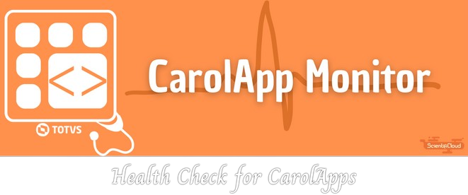

# CarolApp Monitor

{width="600" .center}

    
    
    

---

**Documentation:** [https://github.com/RWallan/carol-app-monitor/tree/main/docs](https://github.com/RWallan/carol-app-monitor/tree/main/docs){target="_blank"}

**Source code:** [https://github.com/RWallan/carol-app-monitor](https://github.com/RWallan/carol-app-monitor){target="_blank"}

---

CarolApp Monitor is a simple and useful app for monitor and restart an online CarolApp if it's not running based on a [*batch* CarolApp](#){target="_blank" .internal-link} that allow you to [configure easily a personalized schedule](#){target="_blank" .internal-link} to run the CarolApp Monitor.



## Why to use CarolApp Monitor:

Sometimes a CarolApp can stop working and you must to get some time to check which apps has stopped and turn them on :disappointed: .

So thinking about it, CarolApp Monitor will monitor your online apps and restart if they stop without the necessity of you expand your time :rocket:.

The key features are:

* **Simple :sweat_smile:**: Simple to configure and install in your Carol tenant.
* **Intuitive :smiling_face_with_3_hearts:**: With fews steps you'll ready to use.
* **No coding :no_entry_sign:**: It's not necessary to be a Python expert coder to use.
* **Fast to learn :fast_forward:**: Great documentation and support to instruct how to configure and install the CarolApp Monitor.

## What CarolApp Monitor do: [ADD Flowchart]

CarolApp Monitor will look periodically all [online CarolApps](#){target="_blank" .internal-link} searching if anyone isn't running and restart your services one by one.

{.center}

## Requirements

Python 3.10+

CarolApp Monitor has been developed on the shoulders of:

* [Poetry](https://python-poetry.org/docs/){target="_blank" .external-link} for Python dependency management.
* [Pycarol](https://pycarol.readthedocs.io/en/2.54.15/index.html){target="_blank" .external-link} for CarolApp processes informations.

## What is TOTVS Carol



This documentation will introduce some definitions and concepts about TOTVS Carol items in [TOTVS Carol](./carol/index.md){target="_blank" .internal-link} section.

!!! abstract "TOTVS Carol Documentation"
    You can read all about TOTVS Carol Plataform with your official documentation [here](https://docs.carol.ai/docs/intro/#totvs-carol){target="_blank" .external-link}

## Installation

TTo use this project in your tenants, you'll need to create and build a CarolApp. 

First, make the download `manifest.json` that include all settings to build your CarolApp. To make the download, just click in the button above :wink:.

    <a href="./assets/teste.txt" download="teste.txt" class="md-button md-button--primary">:material-download: Download manifest</a>

After that, we'll configure your batch CarolApp. To configure this app, you'll need:

1. Create the CarolApp
1. Build the App
1. Add a schedule to your process.

And it's done! :partying_face:

??? tip "Tip"
    We suggest to mantains the "Carol App Monitor" name and the number of version "1.0.0" to your CarolApp.

!!! info "Info"
    You can read the entire tutorial in the [Tutorial](./tutorial/01_introduction.md){.internal-link} section.

## License
This project is licensed under the terms of the MIT license.
