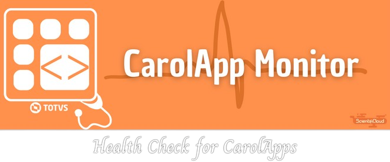

# CarolApp Monitor

{width="600" .center}

    
    

---

**Documentation:** [https://github.com/RWallan/carol-app-monitor/tree/main/docs](https://github.com/RWallan/carol-app-monitor/tree/main/docs)

**Source code:** [https://github.com/RWallan/carol-app-monitor](https://github.com/RWallan/carol-app-monitor)

---

CarolApp Monitor is a simple and useful app for monitor and restart an online CarolApp if it's not running based on a [*batch* CarolApp](#){target="_blank" .internal-link} that allow you to [configure easily a personalized schedule](#){target="_blank" .internal-link} to run the CarolApp Monitor.



## Why to use CarolApp Monitor:

Sometimes a CarolApp can stop working and you must to get some time to check which apps has stopped and turn them on :disappointed: .

So thinking about it, CarolApp Monitor will monitor your online apps and restart if they stop without the necessity of you expand your time :rocket:.

The key features are:

* **Simple :sweat_smile:**: Simple to configure and install in your Carol tenant.
* **Intuitive :smiling_face_with_3_hearts:**: With fews steps you'll ready to use.
* **No coding :no_entry_sign:**: It's not necessary to be a Python expert coder to use.
* **Fast to learn :fast_forward:**: Great documentation and support to instruct how to configure and install the CarolApp Monitor.

## Requirements

Python 3.10+

CarolApp Monitor has been developed on the shoulders of:

* [Poetry](https://python-poetry.org/docs/){target="_blank" .external-link} for Python dependency management.
* [Pycarol](https://pycarol.readthedocs.io/en/2.54.15/index.html){target="_blank" .external-link} for CarolApp processes informations.



## Installation

First, I will show you a few steps that you will always repeat to each project that you want to use CarolApp Monitor. Like a cake recipe🍰.

**Ingredients:**

* A forked repository
* 

**Instructions:**

1. First step
1. Second step
1. Third step

## License
This project is licensed under the terms of the MIT license.