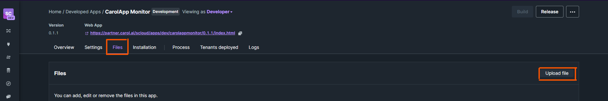
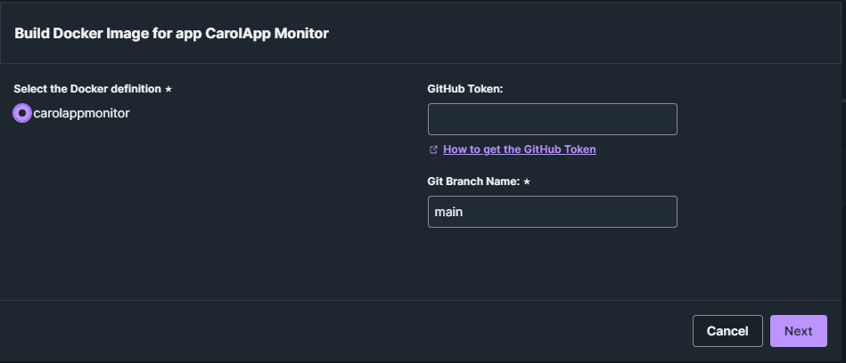
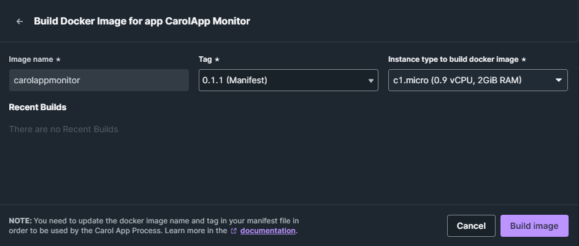
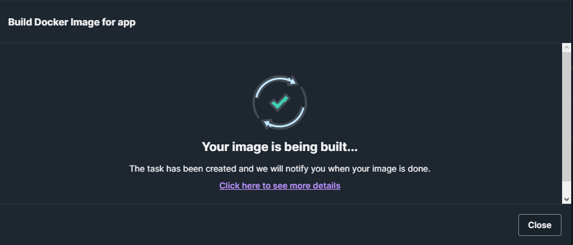

# Building the CarolApp

With the CarolApp created, your next step will be to build the docker image of **CarolApp Monitor** in your CarolApp.

In this tutorial **isn't necessary to know docker to doing this step!**

## Uploading the `manifest.json` file

Go to the CarolApp Monitor in your Carol tenant and:

1. Go to **"Files"** tab.
1. Click on **"Upload file"**.

{.center}

After that, search your `manifest.json` file and select it.

???+ note
    If you haven't downloaded the `manifest.json` file yet, you can make the download [here](index.md){target="_blank" .internal-link}.

## Building the CarolApp Monitor

With your `manifest.json` uploaded, click on **"Build"** check the select box that appears.

{width="550" .center}

!!! note
    You don't need to place the GitHub Token because the repository is public.

Click on **"Next"** and select the version and the type of instance that'll run the **CarolApp Monitor** application.

{width="550" .center}

If you had created your app with the informations suggested by tutorial, the **tag** will be the same for the App Version and Manifest. But we recommend to always choose the version that's be in the manifest.

???+ danger "Instance Type"
    It's suggested to choose the `c1.micro` instance to run the **CarolApp Monitor**. **If you choose other, it can have different costs for the instance.**

While your image is being built, you can work on your Carol tenant normally. **Remember that this process can take a while.**

{width="550" .center}

??? bug "If Your Build Fail"
    Sometimes Carol can start the task to build your image not properlly and because that your image built will be fail.

    Don't worry, just repeat the process to build your image and that should be enough to work.

And it's done! :partying_face: Your **CarolApp Monitor** is ready to configure a schedule and start monitoring your other apps.

!!! warning "Keep Your CarolApp Monitor Updated"
    Always that has an update on **CarolApp Monitor** project, you'll need to **download the new `manifest.json`** file and **repeat the steps described in this section**.

    This will ensure that you always have the updated version of **CarolApp Monitor**.
