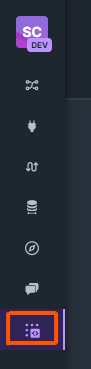

# Creating the CarolApp [WIP]

**CarolApp** is the name gived to the applications developed in TOTVS Carol Plataform.

The cicle of development of a CarolApp consists in:

{.center}

The CarolApp can be of three types:

1. **Online CarolApp:** This type of CarolApp allows provide services in Carol. Basically, endpoints are developed and the implementation happens in Carol.
1. **Batch CarolApp:** This type of CarolApp allows create applications and schedule recorrence to execute them.
1. **Web CarolApp:** This type of CarolApp allows implement any type of HTML content.

## What you need to create a CarolApp

In TOTVS Carol Plataform exists some types of tenants, for example: Prod or Dev tenant.

To create a CarolApp you'll need to have a Dev tenant. To verify if your tenant is a Dev tenant, you can check if the logo in top-left corner has the DEV acronym as you can see the example in image below:

{width="130" .center}

## Creating your first CarolApp

In your Carol Tenant go to the Carol Apps section localized in the last icon on left navigation. In this tab you'll able to see all your CarolApps.

{width="80" .center}

After that, click on **"Create new App"** and input the **CarolApp Monitor** informations. We recommend to placing this informations:

* **Label:** CarolApp Monitor
* **Name:** carolappmonitor
* **Version:** 0.1.1
* **Description:** The CarolApp Monitor is a simple and useful application to monitor and automatically restart online CarolApps if they are not running.

{width="290" .center}

After placing the informations like above click on **"Create App"**.

??? note
    You can place any informations that you want. But it's strongly recommended that the information be the same as in user guide.
