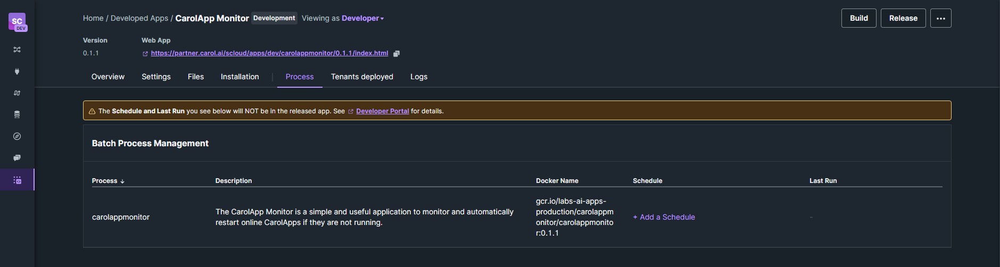
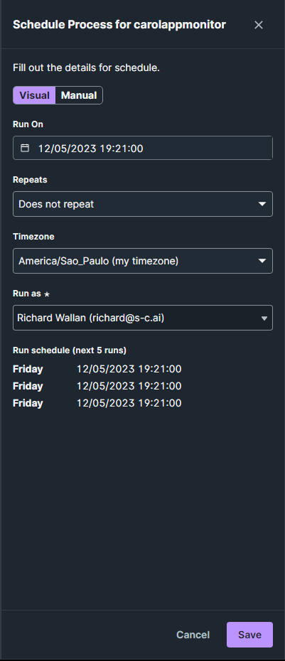
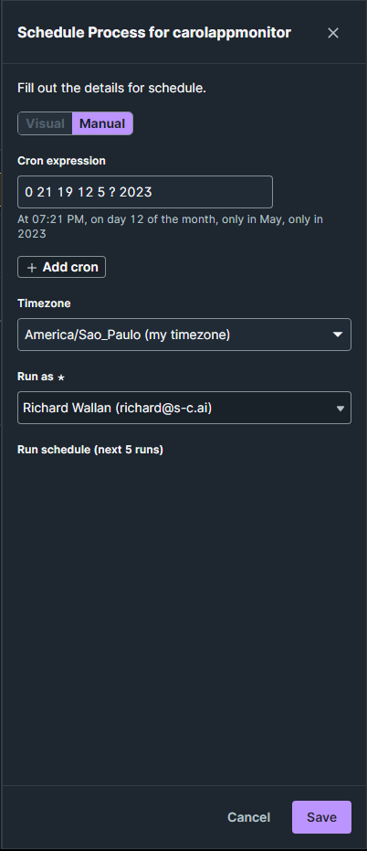

# Configuring your schedule

The **CarolApp Monitor** is configured to be a batch CarolApp, it means that allows to create a schedule recorrence to execute our app.

With that you can personalize your app to your necessity.

## How to create a schedule

To create a schedule to your **CarolApp Monitor**, go to **"Process"** tab. In this tab you can see the process name, the description, the docker name and the schedule column.

In this column you'll have the possibility to add a schedule to run your app.

{.center}

Clicking on **"+ Add a Schedule"** you can create your schedule by two ways: Visual or Manual.

=== "Visual"
    This way you can configure the day and time to run your app in using the calendar widget in the "Run On" field.

    You can determine how your **CarolApp Monitor** will re-run in the "Repeats" field. That can be every hour, day, week or month.

    {width="220" .center}

=== "Manual"
    If you want to can make a more personalized schedule, you can use the cron expression to create your schedule.

    {width="220" .center}

    !!! tip "CronMaker"
        If you want to make a cron expression more easily, you can visit this [link](http://www.cronmaker.com/){target="_blank" .external-link} that allows you to create a cron expression by point and click.

    !!! info "Learn more about Crontab"
        You can learn more about how Crontab works and your expressions by acessing this [link](https://linuxhandbook.com/crontab/){target="_blank" .external-link}.

After this step, you **CarolApp Monitor** is ready to run! :partying_face:
